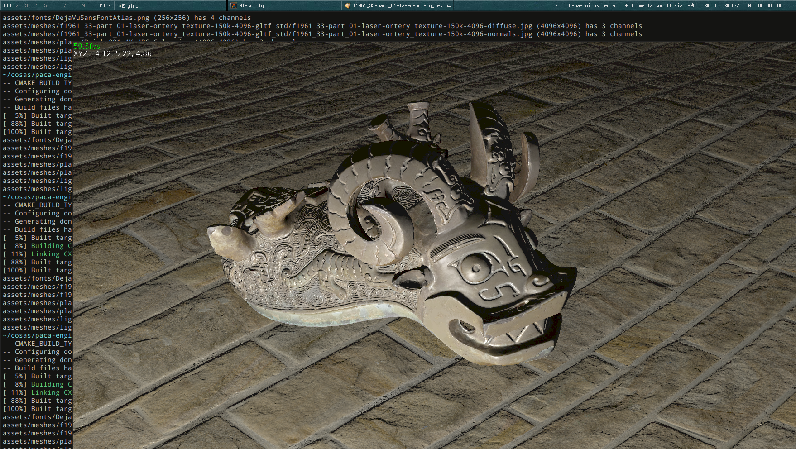

# Linux game engine in C++ using OpenGL



## Dependencies

### External (installed manually with package manager)

- Assimp
- glm
- yaml-cpp
- GLEW

### Included as git submodules

- stb_image
- flecs
- imgui
- ImGuizmo
- implot
- cgltf
- implot
- nativefiledialog-extended

## Building and Running

Make sure you cloned the submodules:

```
git submodule update --init --recursive
```

Build the editor:

```
mkdir build
cd build
cmake .. && make
```

Run from the project root directory:

```
./build/imguieditor/imguieditor
```

It uses imgui's docking branch so you have to arrange the windows in the editor.

